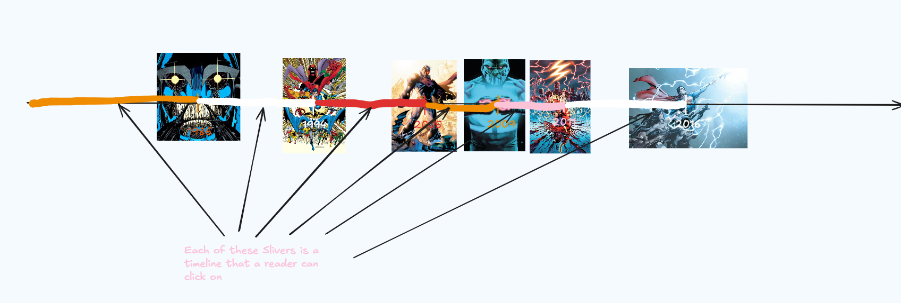
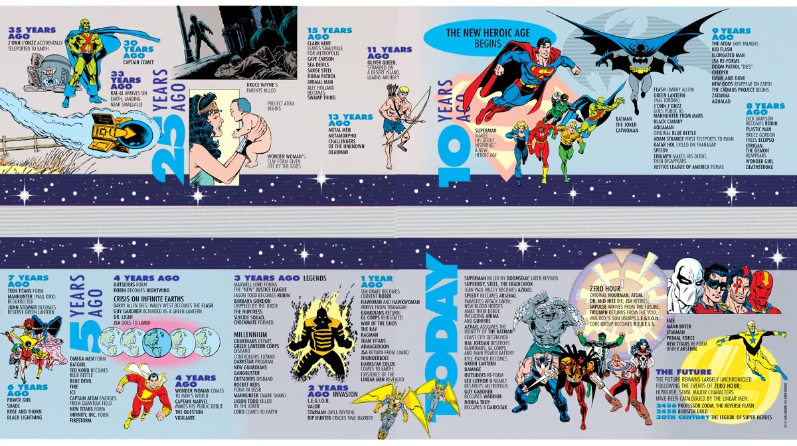

# Visual Planning 

# Fields to add to data

- characters: list that has a string of the primary characters in the book
- authors: list of dictionaries sorted by frequency in the book of {author: <string>, frequency: <number>}
- atrists: same as authors  

# Specifics on what each section means
## Pre Crisis 

## Post Crisis 
### Pre Zero Hour 
https://dc.fandom.com/wiki/History_of_the_DC_Universe_Vol_1 

### Post Zero Hour Pre Infinite Crisis 

### Post Infinite Crisis Pre Final Crisis 

### Post Final Crisis Pre Flashpoint 

## New 52 - Rebirth 

## Modern DC 